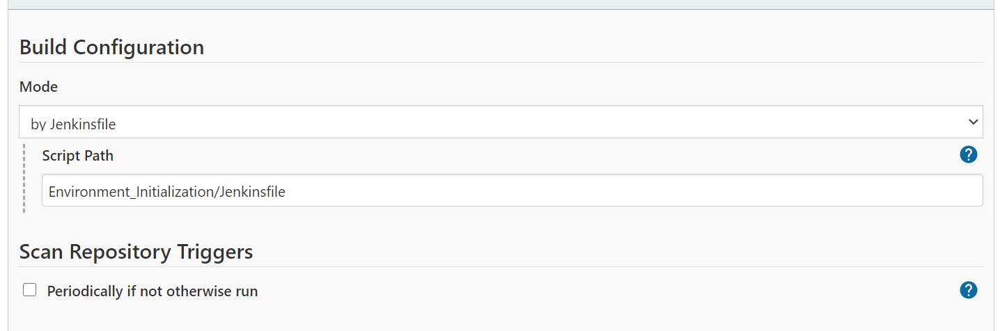

# Jenkins cheat-sheet

This is just a set of tools and info that I find usefull to gather here for future reference.

## Jenkins installation in an EC2 instance using Amazon Linux 2

### Getting the repo
```sh
sudo wget -O /etc/yum.repos.d/jenkins.repo https://pkg.jenkins.io/redhat/jenkins.repo
sudo rpm --import https://pkg.jenkins.io/redhat/jenkins.io.key
sudo yum install jenkins -y
```
### Starting the jenkins service
```sh
sudo service jenkins start
sudo chkconfig jenkins on
```
Also, in case you want to test, stop or restart the jenkins service then use:
```sh
sudo service jenkins restart
sudo service jenkins stop
sudo service jenkins status
```
### Location of the initial Jenkins user password

To retrieve the initial admin password necessary in the Jenkins installation, in the case of a unix system:
```sh
sudo cat /var/lib/jenkins/secrets/initialAdminPassword
```

### Starting Jenkins 1: Jenkins port

To start using Jenkins, you need to be sure of which port is using the jenkins service:
```sh
sudo cat /etc/sysconfig/jenkins | grep JENKINS_PORT
```
Normally it should be port 8080. If another service is using the same port as Jenkins, we can modify the value of ```JENKINS_PORT``` 
to a port which is not used.

In case you want to test which ports are opened, and which services are listening to them:
```sh
sudo netstat -tulpn | grep LISTEN
```

### Starting Jenkins 2: Using Jenkins installed in an EC2 instance

IMPORTANT: It is necessary to add a *rule* to the *security group* of the EC2 instance hosting Jenkins. The rule should allow custom tcp (_TCP personalizada_ in Spanish) traffic type, 
allowing traffic from the IP range needed in your case (origin) through the ```JENKINS_PORT``` value. 

### Starting Jenkins 3: finish Jenkins installation using the web browser

Now you should be able to open Jenkins. You need to navigate to _http://localhost:JENKINS_PORT_ in the case that you installed Jenkins on your PC, or to _http://public IP:JENKINS_PORT_ if it is installed in a remote host. As it should be in the case of Jenkins hosted on an EC2 instance. In this case you can retrieve the value of the public IP or public DNS from the console, or using the shell:
```sh
PUBLIC_IP=$(curl -s ifconfig.co)
echo $PUBLIC_IP
```
I found useful to create an alias which prints out Jenkins address, including the following line at the end of ```/home/ec2-user/.bashrc``` :
```sh
alias showJenkinsURL='dum=\$(curl -s ifconfig.co);echo http://\${dum}:8080'
```
so that, a possible output could be:
```sh
$ showJenkinsURL
http://102.321.21.3:8080
```
The motivation of this alias is the following: every time an EC2 instance is stopped, the public IP is lost; when the instance is restarted, the data is still there, you will find the same jobs and pipelines, but a new public IP will be associated. With this command it is easy to retrieve the Jenkins url everytime you ssh access the EC2 instance after it is restarted.

Once you navigate to your Jenkins url, you must introduce the initial admin password retrieved in a former step. Accept the default plugin installation or customize your choice, enter an admin username and password, and after that you are ready to use Jenkins.

## Jenkins agent

Jenkins configures a unix user, called service user, which doesn't have a shell associated. To login to the jenkins user run:
```sh
sudo su -s /bin/bash jenkins
```
Jenkins creates a folder per job or pipeline in:
```sh
/var/lib/jenkins/workspace
```
you can check the root directory of Jenkins in Control Panel -> Configuration  _http://publicIP:JENKINS_PORT/configure_. 

It is possible to add Jenkins environment variables to the existing ones in _http://publicIP:JENKINS_PORT/configure_.
This variables are shared among jobs and can be used by pipeline scripts as normal unix environment variables. 
Check the Jenkins environment variables in:

* _http://localhost:8080/env-vars.html_
* _http://publicIP:JENKINS_PORT/env-vars.html_


## Create a pipeline

In my experience automating the implementation of Terraform templates with Jenkins Pipelines, if Jenkins and Terraform are installed in the same host, I found useful giving instructions to the jobs/pipelines for creating a workspace folder to store the ```.tf``` project as follows
```sh
/var/lib/jenkins/workspaces/terraform-workspaces
```
so that jobs/pipelines managing Terraform ressources would clone the repositories containing the templates inside the former folder:
```sh
/var/lib/jenkins/workspaces/terraform-workspaces/TF_JOB_REPOSITORY
```
and refer to it for their tasks. In this way, the ```.tfstate``` file will be the same for all pipelines related to each Terraform repository if well configured.
Note that any environment variable that the jenkins service user needs when running the pipelines must be declared in Jenkins.

### Pipeline with script hosted in github

1. Create a new pipeline project, give it a name, and select "multibranch pipeline" type.
2. On the "branch source" section, introduce the url of your github project where the pipeline script is stored.
3. Select the branch that Jenkins must explore (if not master), and in "Build configuration" edit "script path" to match the path of the desired pipeline script inside the repository:

4. Leave the rest of options as default (if you want) and finish clicking OK.

It will start searching the pipeline script on the path given and will clone it into the pipeline workspace inside
```sh
/var/lib/jenkins/workspaces/**pipelineworkspace**/**repository**
```

